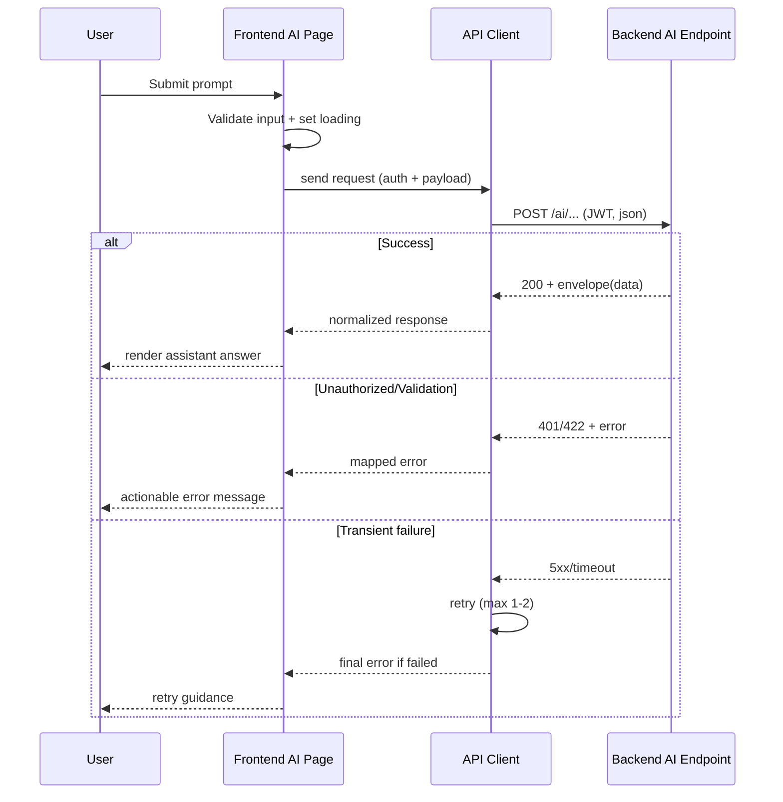

## Context

AI Assistant pada frontend mengalami beberapa kegagalan operasional: request tidak selalu tervalidasi, pemetaan response backend tidak konsisten, dan error state tidak terkomunikasikan dengan baik ke user. Perubahan ini bersifat lintas modul frontend (page, API client, types, UI state, telemetry) dan menyentuh kontrak integrasi backend AI endpoint, sehingga memerlukan desain teknis sebelum implementasi.

Stakeholder utama: pengguna end-user (engineer, team lead, admin), tim frontend, tim backend, dan QA. Constraint utama: tidak mengubah skema database, kompatibel dengan JWT auth yang sudah ada, dan tidak menurunkan UX pada jalur happy-path.

## Goals / Non-Goals

**Goals:**
- Menjamin request AI Assistant selalu mengirim payload valid (prompt, metadata, context) dengan auth token yang benar.
- Menstandarkan parsing response AI agar UI menerima data yang konsisten di semua skenario.
- Menyediakan error handling yang jelas untuk 401/422/5xx, termasuk retry terbatas dan timeout.
- Menambahkan observability minimum (telemetry event) untuk mempermudah diagnosis isu runtime.
- Memastikan perubahan dapat diuji dengan unit/integration tests frontend.

**Non-Goals:**
- Tidak membangun ulang model AI atau logic inferensi di backend.
- Tidak menambah migrasi database atau perubahan skema persistence.
- Tidak menambah fitur produk baru di luar reliability dan kualitas response AI Assistant.

## Decisions

1. **Gunakan API contract adapter khusus AI Assistant di frontend**
- Keputusan: buat mapper terisolasi untuk normalisasi response backend ke model UI tunggal.
- Alasan: menghindari coupling page component dengan variasi response backend.
- Alternatif dipertimbangkan: parsing langsung di page component (ditolak karena sulit di-maintain dan sulit diuji).

2. **Input validation dan submission guard di layer UI**
- Keputusan: validasi prompt sebelum request (empty, batas panjang, trimming) dan lock state saat in-flight.
- Alasan: mencegah 422 yang berasal dari input tidak valid dan mencegah double-submit.
- Alternatif: validasi hanya di backend (ditolak karena UX buruk dan noise error tinggi).

3. **Timeout + retry terbatas hanya untuk error transient**
- Keputusan: timeout per request dan retry maksimal 1-2 kali untuk network error/5xx, tanpa retry untuk 401/422.
- Alasan: meningkatkan keberhasilan request tanpa merusak semantics error validasi/auth.
- Alternatif: retry semua error (ditolak karena memperburuk beban dan tidak menyelesaikan root cause).

4. **Error mapping terstruktur ke UI message catalog**
- Keputusan: map status/code ke pesan user-friendly dan action hint (re-login, cek input, coba lagi).
- Alasan: mengurangi kebingungan user dan mempercepat recovery.
- Alternatif: tampilkan pesan mentah backend (ditolak karena tidak konsisten dan berpotensi membocorkan detail internal).

5. **Telemetry event minimal untuk lifecycle request AI**
- Keputusan: log event client-side untuk submit, success, fail, timeout, retry dengan payload tersanitasi.
- Alasan: mempercepat investigasi issue reliability tanpa menyimpan konten sensitif mentah.
- Alternatif: tanpa telemetry (ditolak karena debugging lambat).

6. **Async pattern tetap berbasis promise/abortable request**
- Keputusan: gunakan request abort (timeout/cancel) dan state machine sederhana (idle/loading/success/error).
- Alasan: mencegah race condition saat user submit berulang atau navigasi cepat.
- Alternatif: polling berkala (ditolak karena tidak relevan untuk chat turn request).

### Sequence Diagram (AI processing flow)

## Risks / Trade-offs

- [Over-normalization response] -> Mitigation: simpan raw error code pada debug metadata agar investigasi tetap akurat.
- [Retry meningkatkan latency pada error] -> Mitigation: batasi retry count dan gunakan backoff pendek.
- [Telemetry berpotensi memuat data sensitif] -> Mitigation: masking prompt content, log hanya metadata non-PII.
- [Perbedaan kontrak backend antar endpoint AI] -> Mitigation: adapter per endpoint + contract tests.
- [Race condition saat submit cepat] -> Mitigation: disable submit saat in-flight + abort request sebelumnya.

## Migration Plan

1. Implement adapter contract AI dan error mapper tanpa mengganti endpoint existing.
2. Integrasikan validasi input, timeout, retry, dan UI state handling di page AI Assistant.
3. Tambahkan telemetry event tersanitasi.
4. Tambahkan/ubah unit dan integration tests.
5. Rollout bertahap via guard/feature toggle internal.
6. Rollback plan: nonaktifkan guard baru untuk kembali ke jalur request lama jika terjadi regresi besar.

Data migration strategy: tidak ada migrasi data karena tidak ada perubahan schema database.

## Open Questions

- Apakah endpoint AI backend sudah final untuk struktur metadata response yang akan dipakai UI?
- Batas prompt maksimum yang disepakati produk untuk menjaga kualitas output dan biaya inferensi?
- Apakah telemetry event akan dikirim ke provider observability tertentu atau cukup console/logger internal dulu?